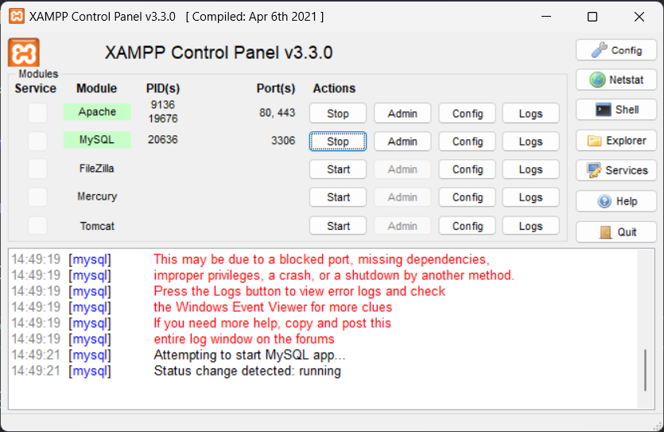
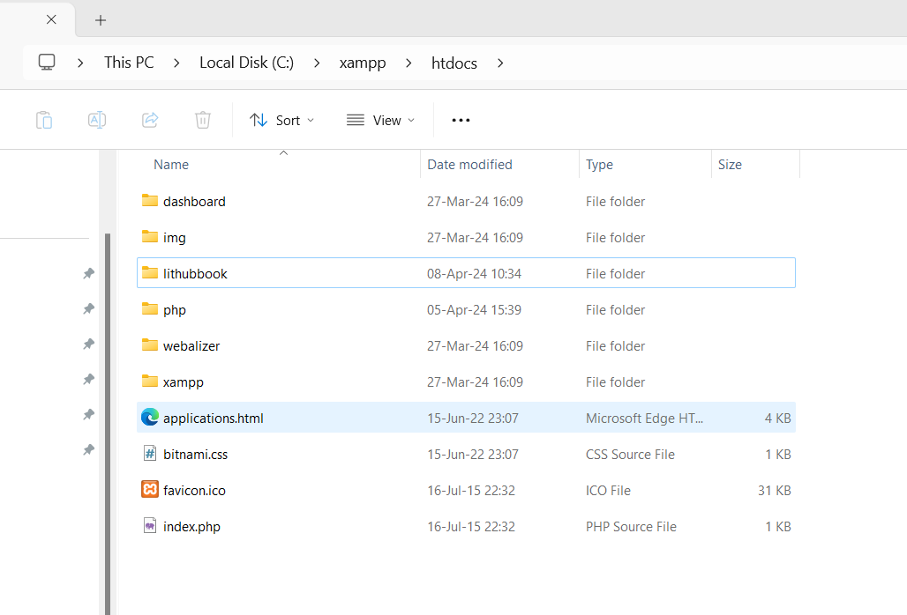
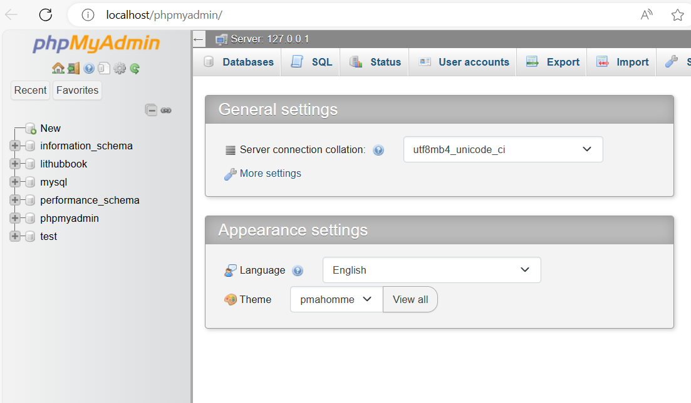

## Download XAMPP

Download XAMPP, version 8.2.12 / PHP 8.2.12

Link: https://www.apachefriends.org/download.html

## XAMPP Control Panel

## XAMPP Folder

Put your project to the `htdocs` folder

Example: `C:\xampp\htdocs`

## MySQL PHP MyAdmin

Go to the URL `http://localhost/phpmyadmin/` to connect to MySQL Database

## Create Database

Go to `http://localhost/phpmyadmin/` then create the Lithubbook database

Then use the `sql` statement in `users.sql` to create the database

